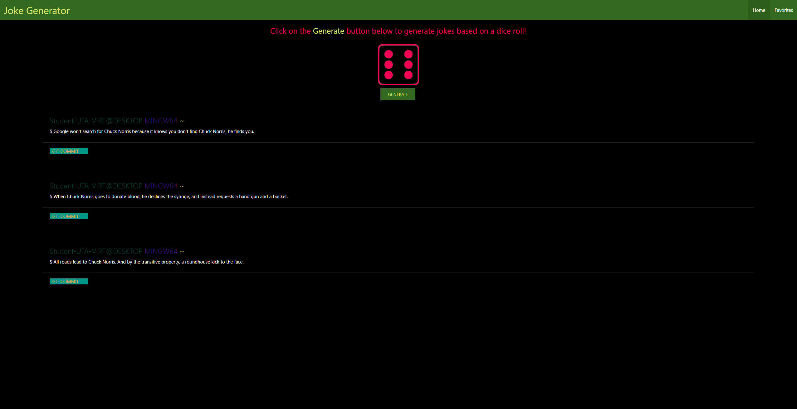

# Joke Generator

## Description

Sometimes we need to look at something funny to brighten our mood. In an effort to create a website that spreads positivity we made a joke generator. Now you can view random jokes that may give you a laugh, and even save them to look at later. We used a variety of different techinques and technologies to make this website, namely materializecss aswell as two apis, roll-dice1.api and the geek-jokes-api.

## Website

## Link

https://danieltbonn.github.io/joke-generator/

## Credits

Amber Diehl, 
Daniel Bonn, 
Eduardo Perez, 
Kiara Johnson

